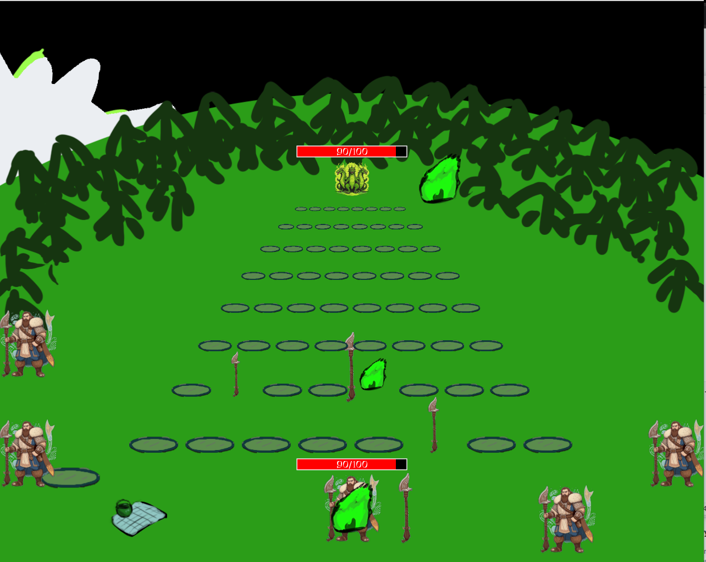
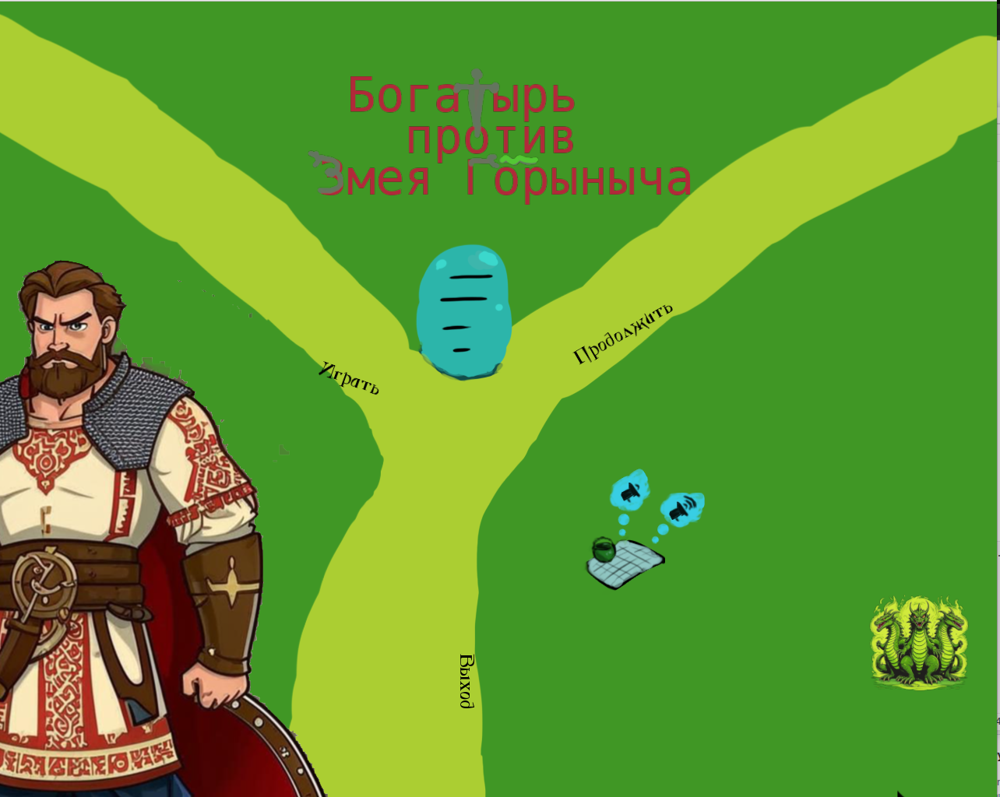
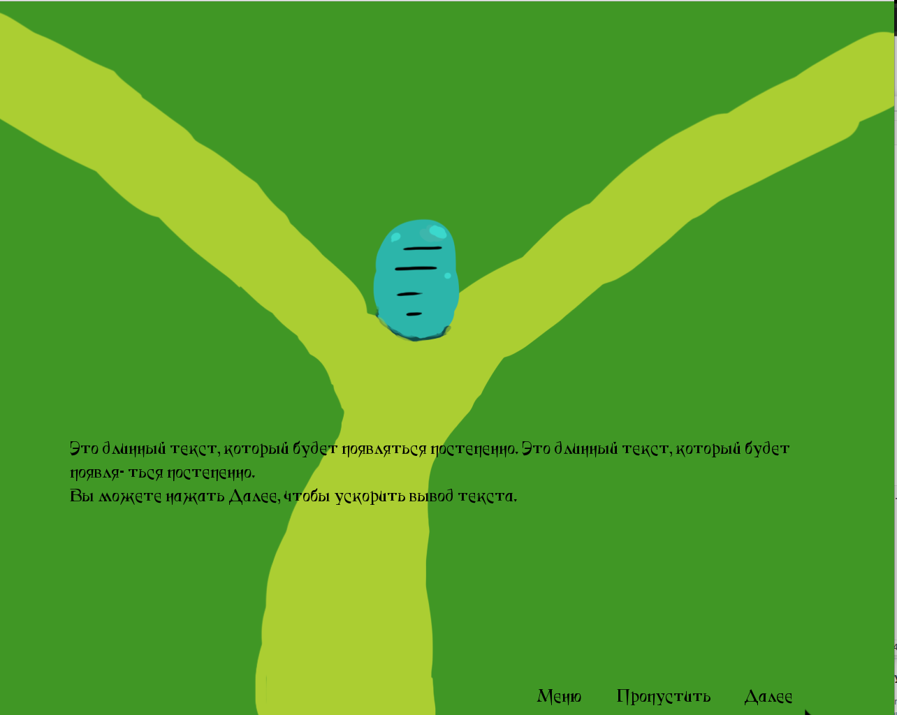

# Богатырь против Змея Горыныча

Пошаговая стратегическая игра с элементами головоломки и RPG, где игрок управляет богатырём в сражении против Змея Горыныча.  

в процессе разработки

- система ходов: игрок и Змей атакуют по очереди;
- механика атак: размещение мечей для нанесения урона и защита от огней;
- комбинации: усиление урона с помощью комбинаций.

Скриншоты

## Технологии  
- [Python 3](https://www.python.org/);
- [Python Arcade 3.1.0](https://api.arcade.academy/en/stable/).

## Разработка

Создание и активация виртуального окружения

> python3 -m venv venv  
> source venv/bin/activate

Установка зависимостей

> pip install -r requirements.txt

Запуск

> python3 main.py

Финальная сборка

> pyinstaller --onefile --windowed --icon=assets/icons/icon.png --add-data="assets/*:assets" main.py

